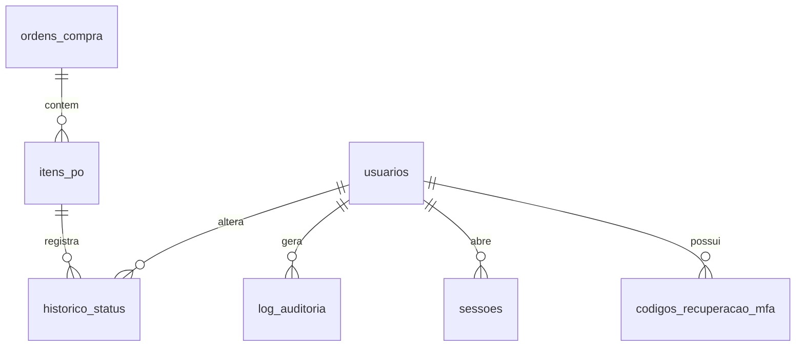

# Fase 0 — Análise da planilha e modelo de dados proposto

Arquivo analisado: `Controle_AMETA 4.xlsx` (enviado em 01/10/2026).
Script que reproduz todos os números: `scripts/fase0/analisar_planilha.py`.
A lista linha a linha dos problemas fica em `inconsistencias.csv`, gerado pelo script (fora do Git, porque contém dados de clientes).

## 1. Abas

| Aba | Conteúdo | Uso na migração |
|---|---|---|
| `AMETA-2025-NEW` | Tabela `Tabela1` (A1:S8577), **8.576 linhas** de dados, uma por item de P.O | **Aba principal**, é a única migrada |
| `REPORT` | Tabela dinâmica: contagem de P.O por status e por mês | Não migra. Está **desatualizada**: soma 9.241 linhas e tem status que não existem mais na aba principal |
| `MENU` | Três listas de opções (andamento, status, status financeiro) | Não migra. Serve só como referência dos valores que já foram usados |

## 2. Colunas da aba principal

| Coluna na planilha | Tipo inferido | Vazios | Observação |
|---|---|---|---|
| `STATUS ` (com espaço no fim) | texto, lista fechada | 0% | 10 valores distintos (seção 3) |
| `STATUS FINANCEIRO` | **fórmula** derivada do STATUS | 0% | NOVO / ENTREGUE / FECHADO. 9 linhas têm valor digitado em vez da fórmula |
| `OBS. DA NF-e` | texto livre | 82,5% | 1.329 linhas com "EMITIDA POR AMETA BOT"; outras citam itens ("ITENS 10,20") ou motivos |
| `ID SITE` | texto | 30,5% | Formatos misturados: `KA25007371` (4.496), só números (1.457), `-` e `_` |
| `P.O` | número de 10 dígitos | 1 linha | 505 linhas têm **apóstrofos/acentos no fim** (`4533171015'`, `´´´`) para burlar a repetição. Ver seção 4 |
| `ITEM` | inteiro (10, 20, 30, 40) | 0,6% | 5 linhas com vários itens numa célula ("10 20 30 40") |
| `SITE` | texto | 27,0% | Um site (`SPCVJY1`) ou par de sites (`SIIBL12-SIIBL02`) |
| `FASE` | texto, lista fechada | 0,5% | K2552 (7.228), F2501 (1.173), K2652 (136) |
| `TECNOLOGIA` | **fórmula** a partir da FASE | 0,5% | F2… → NR, K2… → 5G |
| `PROJETOS` | texto | 0,2% | 66 grafias, que caem para 56 só corrigindo acento, maiúsculas e pontuação (ainda há variações como "Site Surey MW"). "Displacement - São Paulo" aparece de 5 formas por acento quebrado (`S?o`, `S#o`, `S�o`, `SÃo`); 42 linhas têm "SP" (a UF digitada na coluna errada) |
| `UF` | sigla | 20,6% | SP (6.770), RJ (37), RS (3), PR (2) |
| `OPERADORA` | **fórmula** a partir de FASE e PROJETOS | 0,5% | CLARO (7.346), VIVO (1.179), AT&T (12). 6 linhas sobrescritas à mão (K2552 com VIVO) |
| `MULTA` | inteiro (percentual) | 99,6% | 37 linhas preenchidas (29 a 88). Ver seção 5 |
| `PREÇO c/MULTA` | **fórmula** `ORIGINAL × MULTA/100` | 0% | Formato R$ |
| `PREÇO ORIGINAL` | moeda (R$) | 3,7% | 57 valores distintos (97,90 / 350 / 94 / 50,30 / 588…) |
| `N°NFS-e` | inteiro | 15,1% | 2805 a 38421. 6 valores não numéricos ("CONTABILIZADA" ×4, `_38224`, número com espaço invisível) |
| `NOTA EMITIDA` | data | 15,6% | Todas são datas reais do Excel (sem texto). Jan–set/2026, exceto 9 linhas com **10/08/2006** (provável erro de digitação de 2026) |
| `N°MIGO` | inteiro de 10 dígitos | 91,2% | Número do recebimento (MIGO) do cliente |
| `MÊS` | **fórmula** a partir da data | 3,8% | Nome do mês ou "Nota não feita" |
| coluna T (sem nome) | — | 100% | Vazia, fora da tabela. Ignorar |

Não existem na planilha as colunas **cliente/tomador, CNPJ e descrição do serviço** citadas no modelo mínimo do plano. Não foram inventadas (pergunta 3).

## 3. Status encontrados e mapeamento para o enum

| Valor na planilha | Linhas | Valor (R$ c/ multa) | Enum proposto |
|---|---:|---:|---|
| EMITIDA NOTA FISCAL | 7.000 | 2.597.326,81 | `EMITIDA`, `possui_multa = false` |
| EMITIDA NOTA FISCAL C/ MULTA | 16 | 29.225,43 | `EMITIDA`, `possui_multa = true` |
| AGUARDANDO LIBERAÇÃO | 1.211 | 267.990,85 | `AGUARDANDO_LIBERACAO` |
| EMITIR NOTA | 63 | 10.094,40 | `EMITIR_NOTA` |
| EM EXECUÇÃO | 21 | 2.127,75 | `EM_EXECUCAO` |
| P.O CANCELADO | 19 | 8.867,80 | `CANCELADA` |
| SITE CANCELADO | 3 | 0,00 | `CANCELADA` |
| PEDIDO CANCELADO | 1 | 588,00 | `CANCELADA` |
| **NOTA DUPLICADA CANCELADA** | **238** | 118.615,33 | **a decidir** (pergunta 1) |
| **PENDENTE** | **4** | 1.176,00 | **a decidir** (pergunta 2) |
| **Total** | **8.576** | | |

Proposta: guardar o texto original do status num campo `status_origem`, para que "P.O cancelado", "site cancelado" e "pedido cancelado" continuem distinguíveis dentro de `CANCELADA`.
Pelas regras do plano, o que não tiver mapeamento vai para o relatório de rejeição e não é descartado.

## 4. Duplicidades

- **Nenhuma linha 100% idêntica.**
- **O número da P.O não é único.** São 8.086 P.Os distintas em 8.576 linhas: cada linha é um **item** de uma P.O. Os apóstrofos no fim do número existem só para o Excel aceitar a repetição.
- **82 P.Os têm itens em status diferentes** (ex.: item 10 em "Emitir Nota" e itens 20/30/40 já emitidos). Por isso o status precisa ficar no item, não na P.O.
- **P.O + ITEM também se repete em 216 casos.** Em boa parte deles o ITEM foi digitado como 10 para todos os serviços de um combo MW (Site Survey, SCI/SDC, PPI, Displacement), então o que diferencia as linhas é o PROJETO.
- **Possível faturamento em duplicidade:** 68 grupos com mesma P.O + item + projeto e **duas ou mais notas emitidas** (137 linhas, R$ 73.850,90). Exemplo: linhas 95 e 1496, mesma P.O e serviço, notas 34983 (15/04) e 35148 (20/04). Pode ser nota refeita sem marcar a anterior como cancelada. Precisam de conferência antes da migração (pergunta 4).
- **Uma NFS-e cobre várias P.Os:** 681 notas aparecem em mais de uma linha. Isso é normal (nota agrupando P.Os), mas em 104 delas a data de emissão difere entre as linhas e em 37 o status difere.

## 5. Valores monetários e multa

- Os valores já estão como número no Excel (sem texto com vírgula), então a conversão é direta.
- A coluna `MULTA` guarda um **percentual a receber**: `PREÇO c/MULTA = PREÇO ORIGINAL × MULTA / 100`. Ex.: 3.135,00 com MULTA 88 → 2.758,80 (multa de R$ 376,20, ou 12%). Interpretação a confirmar (pergunta 5).
- Divergências: 2 linhas "EMITIDA NOTA FISCAL" com percentual de multa preenchido; 1 linha "C/ MULTA" sem percentual; 1 linha com fórmula de operadora colada na coluna MULTA; 1 linha com multa 0 (preço final zero, P.O cancelada).
- 318 linhas sem preço original (301 delas em "Aguardando Liberação").

## 6. Outras inconsistências

| Problema | Linhas |
|---|---:|
| Status emitido sem nº da NFS-e ou sem data | 18 |
| NFS-e preenchida em status não emitido (Aguardando, Pendente, Cancelado) | 39 |
| Data de emissão em 2006 | 9 |
| FASE vazia (e, por consequência, tecnologia e operadora vazias) | 39 |
| ITEM vazio ou com vários itens na célula | 57 |
| Linha sem número de P.O | 1 |
| P.O com 13 dígitos | 1 |

## 7. Modelo de dados proposto

### Decisão principal: granularidade

| Opção | Prós | Contras |
|---|---|---|
| **A. P.O + itens** (`ordens_compra` 1→N `itens_po`, status no item) **— recomendada** | Reflete a realidade (82 P.Os com itens em status diferentes); acaba com os apóstrofos; a P.O vira de fato única | Telas mostram itens, agrupados por P.O; um pouco mais de modelagem |
| B. Tabela única, uma linha por item (igual à planilha) | Migração 1:1, mais simples | O "número da P.O único" do plano não é possível; dados da P.O repetidos em cada linha |

O dashboard e as abas por status contam **itens** nos dois casos, porque é no item que o status vive.

### Tabelas de negócio (opção A)

**`ordens_compra`** — uma por número de P.O
| Campo | Origem na planilha |
|---|---|
| id (UUID) | — |
| numero_po (texto, **único**, 10 dígitos) | `P.O` sem apóstrofos/espaços |
| criado_em, atualizado_em, criado_por, atualizado_por, excluido_em | — |

**`itens_po`** — uma por linha da planilha
| Campo | Origem na planilha |
|---|---|
| id (UUID), ordem_compra_id (FK) | — |
| item (inteiro, pode ser nulo) | `ITEM` |
| id_site (texto) | `ID SITE` |
| site (texto) | `SITE` |
| fase (texto) | `FASE` |
| tecnologia (enum NR/5G) | `TECNOLOGIA` (valor calculado gravado; sugerido pela fase no cadastro) |
| projeto (texto normalizado) | `PROJETOS` (acentos corrigidos) |
| uf (char 2) | `UF` |
| operadora (enum CLARO/VIVO/AT&T) | `OPERADORA` (valor gravado; sugerido pela fase no cadastro) |
| valor_original (numeric 12,2) | `PREÇO ORIGINAL` |
| percentual_multa (numeric 5,2, nulo = sem multa) | `MULTA` |
| possui_multa (boolean) | status "C/ MULTA" ou percentual preenchido |
| valor_multa (numeric 12,2) | `ORIGINAL − PREÇO c/MULTA` |
| valor_final (numeric 12,2) | `PREÇO c/MULTA` |
| status (enum) | `STATUS` mapeado (seção 3) |
| status_origem (texto) | `STATUS` original |
| numero_nfse (texto, indexado, não único) | `N°NFS-e` |
| data_emissao (date) | `NOTA EMITIDA` |
| numero_migo (texto) | `N°MIGO` |
| observacoes (texto) | `OBS. DA NF-e` |
| linha_planilha (inteiro) | nº da linha, para importação idempotente e rastreio |
| criado_em, atualizado_em, criado_por, atualizado_por, excluido_em | — |

Índices: `status`, `data_emissao`, `numero_nfse`, `ordem_compra_id`, `operadora`.

**Não migram** (são calculadas na hora): `STATUS FINANCEIRO` (deriva do status), `MÊS` (deriva da data) e a coluna T vazia.

**`historico_status`**: item_id, status_de, status_para, possui_multa, usuario_id, motivo, criado_em. Na carga, cada item recebe um registro inicial "importado da planilha".

### Tabelas de acesso e segurança (sem mudança em relação ao plano)

`usuarios`, `codigos_recuperacao_mfa`, `sessoes` / `refresh_tokens`, `log_auditoria`, exatamente como na seção 4.3 do plano.

### Diagrama

## 8. Perguntas para aprovar a Fase 0

1. **"NOTA DUPLICADA CANCELADA" (238 linhas):** a nota foi cancelada por duplicidade e a cobrança válida está em outra linha? Proposta: migrar como `CANCELADA` com `status_origem` preservado.
2. **"PENDENTE" (4 linhas, todas com NFS-e preenchida):** viram `EMITIR_NOTA`, `EMITIDA` ou outro status?
3. **Cliente/tomador e CNPJ** não existem na planilha. O tomador é sempre o mesmo (por exemplo a Ericsson, citada na aba MENU)? Proposta: não criar esses campos agora.
4. **Os 68 grupos com possível nota em duplicidade** (R$ 73.850,90): migro como estão e marco para revisão na tela, ou você prefere conferir antes?
5. **Multa:** confirma que `MULTA = 88` significa receber 88% do valor (multa de 12%)?
6. **Datas 10/08/2006 (9 linhas):** corrijo para 10/08/2026?
7. **Granularidade:** aprova a opção A (P.O + itens, status no item)?
8. **Planilha no repositório:** o repositório é privado. Mesmo assim, recomendo deixar a planilha fora do Git (pasta `data/` ignorada) e manter a cópia só nos arquivos do projeto. Concorda?
