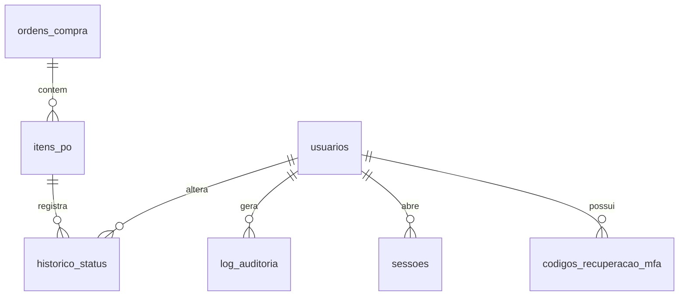

# Fase 1 — Banco de dados

Banco PostgreSQL 16, schema em Prisma, script de importação da planilha e testes das operações (inserir, editar, mover de status, remover e consultar).

## Onde roda

| Ambiente | Como | Custo |
|---|---|---|
| **Local (agora)** | PostgreSQL 16 em Docker no seu computador (`docker compose`) | Grátis |
| AWS (Fase 5) | Amazon RDS PostgreSQL 16 | Pago, só com sua autorização |

O mesmo schema e as mesmas migrações rodam nos dois. Para ir à AWS basta trocar a `DATABASE_URL`.
Os dados ficam só no seu computador; nenhum serviço de terceiros recebe dados de clientes.

## Modelo de dados



- **`ordens_compra`**: uma linha por número de P.O, que agora é único (sem os apóstrofos da planilha).
- **`itens_po`**: uma linha por linha da planilha. No padrão novo é a P.O inteira (ITEM `10 20 30`); quando os itens foram faturados em notas separadas, cada item tem a sua linha. **O status fica aqui**, porque itens da mesma P.O podem estar em status diferentes.
- **`historico_status`**: toda mudança de status (de → para, quem, quando, motivo). Cada linha importada ganha um registro inicial "Importado da planilha".
- **`usuarios`, `codigos_recuperacao_mfa`, `sessoes`, `log_auditoria`**: tabelas de acesso já criadas, usadas a partir da Fase 2.
- **`vw_itens_po`**: view com as colunas que na planilha são fórmulas, calculadas na hora para nunca ficarem desatualizadas.

### Mapeamento planilha → banco

| Planilha (aba AMETA-2025-NEW) | Banco | Regra |
|---|---|---|
| `P.O` | `ordens_compra.numero_po` | Só os dígitos (tira `'`, `´`, espaços) |
| `STATUS` | `itens_po.status` + `status_origem` | Tabela abaixo; o texto original fica guardado |
| `ITEM` | `item` | Só os 9 valores permitidos: 10, 20, 30, 40, 50, `10 20`, `10 20 30`, `10 20 30 40`, `10 20 30 40 50` |
| `ID SITE`, `SITE`, `FASE`, `PROJETOS`, `UF` | `id_site`, `site`, `fase`, `projeto`, `uf` | Texto sem espaços sobrando |
| `TECNOLOGIA`, `OPERADORA` | `tecnologia`, `operadora` | Valor gravado como está (há valores digitados por cima da fórmula) |
| `PREÇO ORIGINAL` | `valor_original` | numeric(12,2) |
| `MULTA` | `percentual_multa` | Percentual a receber (88 = recebe 88%) |
| `N°NFS-e`, `NOTA EMITIDA`, `N°MIGO` | `numero_nfse`, `data_emissao`, `numero_migo` | |
| `OBS. DA NF-e` | `observacoes` | |
| `STATUS FINANCEIRO` (fórmula) | `vw_itens_po.status_financeiro` | Emitida = FECHADO, Emitir Nota = ENTREGUE, resto = NOVO |
| `PREÇO c/MULTA` (fórmula) | `vw_itens_po.valor_final` e `valor_multa` | ORIGINAL × MULTA / 100, ou ORIGINAL sem multa |
| `MÊS` (fórmula) | `vw_itens_po.mes_emissao` | Mês da data de emissão |

| STATUS na planilha | Status no banco |
|---|---|
| AGUARDANDO LIBERAÇÃO | `AGUARDANDO_LIBERACAO` |
| EMITIR NOTA | `EMITIR_NOTA` |
| EM EXECUÇÃO (e o antigo PENDENTE) | `EM_EXECUCAO` |
| EMITIDA NOTA FISCAL | `EMITIDA` |
| EMITIDA NOTA FISCAL C/ MULTA | `EMITIDA` com `possui_multa = true` |
| CANCELADO (e os antigos P.O / PEDIDO / SITE CANCELADO, NOTA DUPLICADA CANCELADA) | `CANCELADO` |

Regras garantidas pelo próprio banco (CHECK): ITEM na lista, tecnologia NR/5G, operadora CLARO/VIVO/AT&T, UF com 2 letras, multa de 0 a 100, multa só em nota emitida, P.O só com dígitos.

## Importação

```bash
npm run import:planilha -- --file ./data/Controle_AMETA_12.xlsx
```

- Roda numa transação só: ou importa tudo, ou nada.
- **Idempotente**: a chave é a linha da planilha. Rodar de novo com o mesmo arquivo não muda nada; com o arquivo alterado, atualiza as linhas que mudaram e registra no histórico as mudanças de status.
- Linhas que não dá para importar (P.O vazia, status desconhecido, ITEM fora da lista, valor ou data ilegível) vão para `data/importacao/rejeitadas.csv` com o motivo. Nada é descartado em silêncio.
- Linhas importadas que merecem conferência (NFS-e em status não emitido, data em 2006, NFS-e "CONTABILIZADA", status financeiro digitado à mão etc.) vão para `data/importacao/avisos.csv`.
- No fim, confere direto no banco: linhas por status, emitidas com multa, P.Os distintas, soma do PREÇO ORIGINAL (banco + rejeitadas = planilha) e se todo item tem histórico. Se algo não bater, o comando termina com erro.

Os dois CSVs ficam fora do Git porque têm dados de clientes.

## Operações e testes

`api/src/ordens/ordens.ts` tem as operações que a API vai usar na Fase 2: inserir, editar, mover de status, remover (soft delete), restaurar, excluir definitivamente, remover a P.O inteira, listar com filtros e contar por status. Toda alteração grava em `log_auditoria` com valores antes/depois.

Os testes (`npm test`) usam um banco separado terminado em `_teste` e cobrem:

- inserir P.O e itens, com o primeiro registro de histórico;
- mover Aguardando Liberação → Emitir Nota → Emitida c/ multa, conferindo o histórico e as colunas calculadas;
- soft delete (some das listagens, fica no banco e na auditoria), restaurar e exclusão definitiva;
- editar e consultar por status, período de emissão, número da P.O e da NFS-e;
- regras do banco (ITEM fora da lista e multa fora de nota emitida são recusados);
- importação de uma planilha fictícia: rejeições com motivo, totais, idempotência e reimportação com mudança de status.

## Fica para as próximas fases

- Usuário de banco sem privilégio de dono para a API e Row Level Security (Fase 4, item RLS do plano).
- Permissões por perfil em cada operação (Fase 2).
- Perguntas ainda abertas da Fase 0 (3 a 8). Enquanto não forem respondidas, nada foi alterado nos dados: as datas de 2006, os possíveis faturamentos em duplicidade e os demais casos entram como estão e aparecem em `avisos.csv`.
