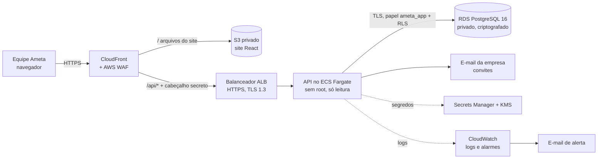

# Fase 5: preparação para a AWS

Esta fase só **prepara**: nada é criado na AWS e nada vai ao ar sem autorização da Ameta.
Este documento cobre:
- a arquitetura;
- o custo estimado;
- o que a Ameta precisa providenciar;
- o passo a passo do primeiro deploy, das versões seguintes e do dia da troca da planilha pelo site.

| Arquivo | O que é |
|---|---|
| `api/Dockerfile.producao` | Imagem de produção multi-stage. A imagem final tem só Node, sem shell, sem gerenciador de pacotes e sem root (uid 65532). |
| `api/scripts/producao.mjs` | Tarefas avulsas na AWS: migrações, primeiro ADMIN e importação da planilha. |
| `infra/terraform/` | Infraestrutura como código (Terraform). É uma proposta: validada (`terraform validate`), nunca aplicada. |
| `.github/workflows/ci.yml` | O CI agora também gera a imagem de produção e valida o Terraform a cada envio. |

## Arquitetura



- **Região:** São Paulo (`sa-east-1`), para os dados ficarem no Brasil. Só o certificado do site e o WAF ficam em `us-east-1`, porque o CloudFront exige.
- **Um endereço só** (ex.: `https://controle.ametaservicos.com.br`): o CloudFront entrega o site e repassa `/api/*` para a API. Os cookies `SameSite=Strict` funcionam sem abrir CORS, como no ambiente local.
- **O balanceador só aceita o CloudFront.** Isso vale pela rede (lista de IPs do CloudFront) e por um cabeçalho secreto. Ninguém consegue pular o WAF indo direto ao balanceador.
- **A API não recebe nenhuma conexão de fora.**
  - Ela fica numa subrede pública só para conseguir *sair* (baixar a imagem, enviar e-mail).
  - O grupo de segurança só aceita o balanceador.
  - Isso dispensa o NAT Gateway, que custaria cerca de US$ 40 por mês.
- **O banco fica em subredes privadas, sem rota para a internet.**
  - Só a API e as tarefas avulsas chegam nele.
  - O TLS é obrigatório (`rds.force_ssl=1`).
  - Disco, backups e segredos são criptografados com a chave KMS da Ameta, que troca sozinha todo ano.
- **Backups:** automáticos todo dia às 3h (Brasília), guardados por 14 dias, com restauração para qualquer minuto desse período. O banco tem proteção contra exclusão e faz um snapshot final se for apagado.
- **Segredos:**
  - As chaves da API e a senha do papel `ameta_app` são geradas pelo Terraform e guardadas no Secrets Manager.
  - A senha do usuário dono do banco é gerada e trocada pelo próprio RDS: ninguém precisa conhecê-la.
  - A senha do e-mail é preenchida à mão no console.
- **Versões novas:**
  - A API sobe a cópia nova antes de desligar a antiga, então não há tempo fora do ar.
  - Se a versão nova não ficar saudável, o ECS volta sozinho para a anterior.
  - As imagens no ECR são imutáveis e passam por varredura de vulnerabilidades.
- **Alarmes por e-mail:**
  - site fora do ar (nenhuma API saudável);
  - erros 5xx ou erros internos na API;
  - CPU do banco alta;
  - pouco espaço no disco do banco.

### Segurança na AWS (complementa o relatório da Fase 4)

| Item | Como |
|---|---|
| HTTPS | Certificados ACM grátis e renovados sozinhos. TLS 1.2 ou superior no CloudFront, TLS 1.3 no balanceador. HTTP vira HTTPS. HSTS de 1 ano. |
| WAF | Regras gerenciadas da AWS: reputação de IP, regras comuns (OWASP), entradas maliciosas conhecidas e SQL injection. Limite de 100 pedidos a cada 5 min por IP nas rotas de login e de 2.000 nas demais. Pedidos bloqueados ficam registrados por 90 dias. |
| Menor privilégio | A API roda com um papel AWS sem nenhuma permissão. Só o ECS lê os segredos. No banco, a API usa `ameta_app` com RLS (Fase 4). |
| Contêiner | Sem shell, sem root, disco só leitura (apenas `/tmp` gravável), sem acesso remoto ao contêiner (`execute command` desligado). |
| IP real nos logs | `CONFIAR_PROXY=2` (CloudFront + balanceador). A auditoria e os limites de tentativas usam o IP de quem acessa. |
| Logs | API, tarefas e WAF no CloudWatch por 90 dias. Os cookies e o token CSRF não aparecem nos logs do WAF. |

## Custo estimado por mês

Os preços são do catálogo público da AWS para São Paulo, consultado em 07/10/2026, sem impostos e com uso baixo (a equipe da Ameta). Confira na [calculadora da AWS](https://calculator.aws/) antes de aprovar.

| Item | Configuração | US$/mês |
|---|---|---:|
| API (ECS Fargate) | 1 cópia, 0,5 vCPU e 1 GB, 24 h | 31,00 |
| Balanceador (ALB) | 1 balanceador + uso baixo | 27,00 |
| IPs públicos | 2 do balanceador + 1 da API (US$ 0,005/h cada) | 11,00 |
| Banco (RDS) | db.t4g.micro, 1 zona, 20 GB gp3, backups de 14 dias | 29,20 |
| WAF | 1 lista + 6 regras + pedidos | 12,00 |
| CloudFront + S3 | Dentro da faixa grátis para este volume | 1,00 |
| Secrets Manager + KMS | 3 segredos + 1 chave | 2,20 |
| CloudWatch | Logs, 5 alarmes, Container Insights | 5,00 |
| ECR + Route 53 | Imagens + 1 zona DNS | 0,80 |
| **Total** | | **≈ 119** (≈ R$ 650 com o dólar a R$ 5,50) |

- **Banco com cópia em outra zona (Multi-AZ):** acrescenta cerca de US$ 29, total de uns **US$ 148/mês**. Recomendado quando o site virar o único controle. É uma mudança de uma linha (`banco_multi_az = true`), com poucos minutos de lentidão.
- **Para gastar menos:**
  - Reservar o banco por 1 ano reduz cerca de 30% dele.
  - Desligar o Container Insights economiza uns US$ 3.
  - Existe também uma versão mais simples, um único servidor com tudo dentro por cerca de US$ 20 a 30/mês. Ela abre mão do WAF, do banco gerenciado com backups e da volta automática de versão, e eu não recomendo para dados de faturamento.
- **Alerta de gastos:** o checklist inclui um orçamento no AWS Budgets que avisa por e-mail se o mês passar de US$ 150.

## O que a Ameta precisa providenciar

1. **Conta AWS da empresa**, com MFA no usuário raiz e um usuário administrador para o deploy (IAM Identity Center).
2. **Endereço do site**, ex.: `controle.ametaservicos.com.br`.
   - A zona DNS precisa estar no Route 53.
   - Se o DNS da empresa estiver em outro lugar, basta delegar o subdomínio: um registro NS no provedor atual.
3. **Servidor de e-mail para os convites:** host, porta, usuário e senha (ex.: Microsoft 365 `smtp.office365.com:587`), e o remetente (ex.: `nao-responda@ametaservicos.com.br`).
4. **E-mail real do primeiro ADMIN** e um **e-mail para receber os alarmes**.
5. **Aprovação do custo** acima.
6. **Revisão jurídica** do texto dos Termos de Uso e da Política de Privacidade (versão 1.0 é rascunho).

## Checklist do primeiro deploy

Rodar num computador com AWS CLI, Docker e Terraform 1.13 (ou pelo AWS CloudShell, que já tem quase tudo).

**Antes**
- [ ] Criar o bucket do estado do Terraform:
  - privado, criptografado e com versionamento;
  - ex.: `ameta-terraform-estado` em `sa-east-1`;
  - depois descomentar o bloco `backend "s3"` em `infra/terraform/versoes.tf`.
- [ ] Criar um orçamento no AWS Budgets (alerta em US$ 150).
- [ ] Copiar `infra/terraform/exemplo.tfvars` para `producao.tfvars` e preencher. Esse arquivo fica fora do Git.

**Infraestrutura** (com autorização da Ameta)
- [ ] `cd infra/terraform && terraform init`
- [ ] Criar primeiro os repositórios de imagens:
  ```bash
  terraform apply -var-file=producao.tfvars -target=aws_ecr_repository.api
  ```
- [ ] Enviar as imagens com a versão escolhida em `versao_api`, ex.: `1.0.0`:
  ```bash
  aws ecr get-login-password --region sa-east-1 | docker login --username AWS --password-stdin <conta>.dkr.ecr.sa-east-1.amazonaws.com
  docker build -f api/Dockerfile.producao --target api -t <repo api>:1.0.0 .
  docker build -f api/Dockerfile.producao --target migracao -t <repo migracao>:1.0.0 .
  docker push <repo api>:1.0.0
  docker push <repo migracao>:1.0.0
  ```
- [ ] `terraform plan -var-file=producao.tfvars -out=plano.tfplan`, revisar o plano e depois `terraform apply plano.tfplan`.
  - Leva uns 15 minutos (banco e CloudFront).
  - A API ainda não fica saudável porque o banco está vazio. A próxima etapa resolve.
- [ ] Confirmar a inscrição no e-mail de alarmes que a AWS enviar.
- [ ] No console do Secrets Manager, preencher `ameta-nfse/smtp` com `SMTP_USUARIO` e `SMTP_SENHA`.

**Banco e primeiro acesso**
- [ ] Rodar as migrações:
  - usar o comando que o Terraform mostra em `comando_migracao`;
  - acompanhar no CloudWatch, grupo `/ameta-nfse/tarefas`;
  - esperar "Papel da API pronto".
- [ ] Reiniciar a API: `aws ecs update-service --cluster ameta-nfse --service api --force-new-deployment`.
- [ ] Criar o primeiro ADMIN. A senha é provisória: no primeiro login o site pede para trocá-la e cadastrar o autenticador.
  ```bash
  <comando_tarefa_base> --overrides '{"containerOverrides":[{"name":"migracao",
    "command":["node","scripts/producao.mjs","admin","--nome","Nome do ADMIN","--email","email@ametaservicos.com.br"],
    "environment":[{"name":"SENHA_ADMIN","value":"uma senha provisória longa"}]}]}'
  ```

**Site**
- [ ] Gerar o site e publicar:
  ```bash
  npm ci && npm -w web run build
  # Arquivos com hash no nome: cache longo. index.html: sempre conferir se mudou.
  aws s3 sync web/dist s3://<bucket_site> --delete --exclude index.html --cache-control "public,max-age=31536000,immutable"
  aws s3 cp web/dist/index.html s3://<bucket_site>/index.html --cache-control "no-cache"
  aws cloudfront create-invalidation --distribution-id <cloudfront_id> --paths "/index.html"
  ```

**Conferir**
- [ ] Abrir o site, entrar com o ADMIN, trocar a senha e cadastrar o autenticador.
- [ ] Aceitar os termos e criar um usuário de teste. O convite deve chegar no e-mail real.
- [ ] `curl -I https://<dominio>/` mostra os cabeçalhos de segurança.
- [ ] `curl -i https://origem-api.<dominio>/api/v1/saude` responde 403 (o balanceador só aceita o CloudFront).
- [ ] `npm run security:scan` sem falhas antes de cada versão.

## Versões seguintes

1. CI verde no GitHub.
2. Gerar e enviar as duas imagens com uma tag nova, ex.: o hash do commit. As tags são imutáveis.
3. Atualizar `versao_api` em `producao.tfvars` e rodar `terraform apply`. Isso registra as novas definições de tarefa.
4. Rodar as migrações (`comando_migracao`). Até agora as migrações deste projeto só acrescentam colunas e tabelas, então a versão antiga continua funcionando durante a troca.
5. O ECS troca a API sozinho, sem tempo fora do ar. Se a versão nova falhar, ele volta para a anterior.
6. Se o site mudou, publicar `web/dist` como no primeiro deploy.

## Dia da troca (planilha → site)

1. Avisar a equipe e congelar a planilha: ninguém edita a partir de um horário combinado.
2. Enviar a planilha final para um bucket S3 privado da conta e gerar um link temporário: `aws s3 presign s3://<bucket>/planilha.xlsx --expires-in 900`.
3. Importar:
   ```bash
   <comando_tarefa_base> --overrides '{"containerOverrides":[{"name":"migracao",
     "command":["node","scripts/producao.mjs","importar"],
     "environment":[{"name":"PLANILHA_URL","value":"<link temporário>"}]}]}'
   ```
4. Conferir no log (`/ameta-nfse/tarefas`) as linhas "OK" e os totais por status contra a planilha, como na Fase 1.
5. Apagar a planilha do bucket.
6. A partir daí, todo o trabalho acontece no site e a planilha fica só como arquivo.

## Voltar atrás

- **Versão ruim da API:** o ECS volta sozinho. Também dá para rodar `terraform apply` com a `versao_api` anterior.
- **Dados apagados ou corrompidos:** restaurar o RDS para um minuto antes do problema. Ele cria um banco novo; depois é só apontar o Terraform para ele.
- **Desligar tudo:** `terraform destroy`. Ele exige tirar antes a proteção contra exclusão do banco e do balanceador, de propósito, e o banco deixa um snapshot final.
